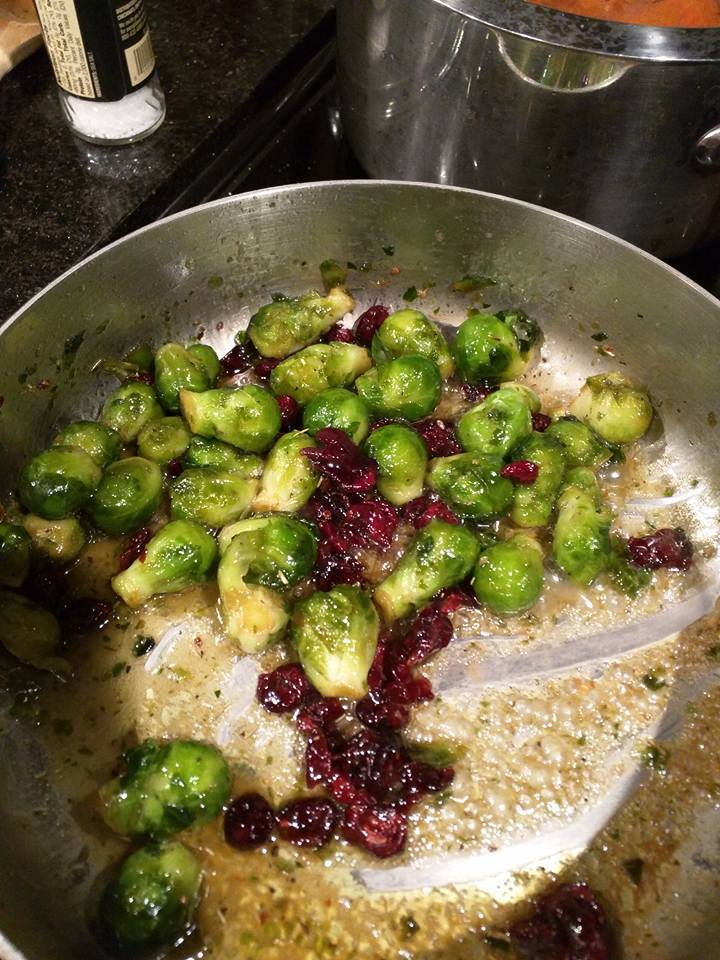

# dis0wn - Whiskey Cranberry Brussel Sprouts

This is one of my wife\'s favorite sides and even if you hate brussel
sprouts, this might be your opportunity to change your mind. Feeds 5-6 people.

Great with red meat and red wine.

## Ingredients

- 1 pkg frozen brussel sprouts or 12 to 14 fresh brussel sprouts
- 1/2 cup dried cranberries
- 2 tbsp salt
- 4 tbps Butter
- 2 to 3 tbsp Brown Sugar
- 1 shot of your favorite whiskey/bourbon
- Torch or stick lighter. Don't use a regular lighter. You'll lose arm hair.

## Instructions

Prepare your brussel sprouts depending on the option you picked above.

### Frozen (quick option)

- Nuke \'em as directed on the package.
- Melt helf the butter in frying pan or wok.
- Increase heat to Medium and add sprouts.
  - Too much heat will burn the butter.
- Let them brown a little on the outside then proceed to step 2.

### Fresh (tasty option)

- Cut sprouts in half and place them on a baking sheet with cut side
 up. Cover with foil for easy cleanup.
- Drizzle olive oil over each and sprinkle with a light layer of salt.
- Bake \@ 400F for 20 to 30 min. Add more time (about 10 minutes) if you like them crispy!
- Melt half the butter in a frying pan or wok on Low-Medium heat. Too
 much heat will burn the butter.
- Add the sprouts.
- Add brown sugar, dried cranberries, and remaining 2 tbps of butter.
- Stir on Low-Medium heat until all the brown sugar has disolved.
- Toss in the shot of whiskey. Count to 3. Stand back and light it.
  - The flames will go out once all the alcohol has burned off.
  - Make sure the cooking area is free of dry material with a high surface area. It\'ll be tough trying to explain that one to the fire marshall.
- Now that the fire is out, transfer the sprouts and the Vorpal Glaze of Awesomeness to a serving dish or directly to the plate.
